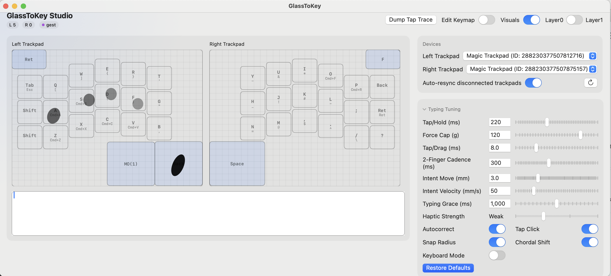
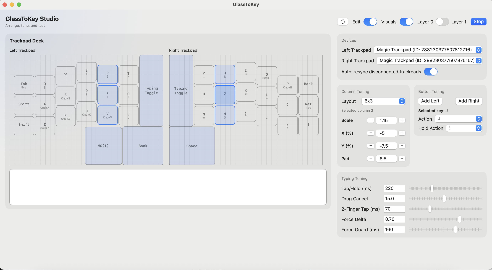

# GlassToKey

## Intention
An attempt to use the Apple Magic Trackpad as a keyboard (and mouse!) like the TouchStream LP~
Since it is built on the same technology, I thought it would be fun to try and create an open source version!


It's just Codex and I vibe coding~ You can submit an issue but this is really just a repo for me, you might have to fork and extend!

## Usage

Build the GlassToKey project and you are good to go! A status bar indicator shows the active mode:
- **Green**: Mixed mode (typing + mouse intent)
- **Purple**: Keyboard mode (full keyboard, no mouse intent)
- **Red**: Mouse-only mode (typing disabled)

Clicking the indicator light will allow you to view the Config or Quit the program.



**Clicking Visualize will draw the touches - it is toggleable for performance reasons.**

Clicking Edit will allow you to click any Column/Button and set the Action/Hold Action and set the positioning and size. (It's really laggy idk what to do, so it's in a toggle)



## Typing Tuning
- Tap/Hold (ms): Time in miliseconds until a tap becomes a hold
- Drag Cancel (mm): How far you need to move before tap becomes a drag
- Force Cap (g): Pressure (in grams) beyond the initial touch that disqualifies the touch before it can type, preventing accidental strong presses.
- Typing Grace (ms): Time after a key dispatch to keep typing intent active.
- Intent Move (mm): Movement threshold before a touch is treated as mouse intent.
- Intent Velocity (mm/s): Speed threshold before a touch is treated as mouse intent.
- Snap Radius (%): On release during typing intent, off-key taps will snap to the nearest key center if the release point is within this percent of the key’s smaller dimension.
- Autocorrect: Enables the built-in autocorrect engine for post-key dispatch word replacement.
- Tap Click: two-finger tap = left click, three-finger tap = right click
- Mouse Takeover: Allow mouse intent to interrupt typing before all fingers are lifted.
- Keyboard Mode: When enabled, the typing toggle (and 5‑finger swipe) switches between **full keyboard** and **mouse‑only**. In keyboard mode, mouse down/up events are blocked globally (except inside the GlassToKey config window) and tap‑click gestures are disabled. Blocking clicks requires Input Monitoring/Accessibility permission.

## Intent State Machine
GlassToKey runs a simple intent state machine to decide when touches should be interpreted as typing vs mouse input. The UI intent badges use these labels: `idle`, `cand`, `typing`, `mouse`, `gest`.

```
           on-key + stable                 buffer elapsed
      ┌──────────────────────┐         ┌───────────────────┐
      ▼                      │         ▼                   │
[idle] → [cand] → [typing] ← [mouse] ← [mouseActive] ← [mouseCandidate]
  │        │          │           ▲
  │        │          └─ grace ────┘
  │        └─ mouse-like motion → [mouseCandidate]
  └─ 2+ touches in buffer (or 3+ simultaneous) → [gest] ──> [idle]
```

- **Idle (`idle`)**: No active contacts. Any touch that begins on a key enters `keyCandidate`; otherwise it enters `mouseCandidate`.
- **KeyCandidate (`cand`)**: A short buffer window (fixed at 40ms) watches for mouse-like motion. If the touch stays within thresholds, it becomes `typingCommitted`.
- **TypingCommitted (`typing`)**: Key dispatches are allowed. Typing Grace keeps this state alive for a short window after a key is released.
- **MouseCandidate (`mouse`)**: Short buffer window (fixed at 40ms) watching for mouse-like motion. If motion exceeds thresholds or the buffer elapses, it becomes `mouseActive`.
- **MouseActive (`mouse`)**: Typing is suppressed while mouse intent is active (unless mouse takeover is disabled).
- **GestureCandidate (`gest`)**: Multi-finger gesture guard. If 2+ touches begin within the 40ms buffer (or 3+ touches arrive together), typing is suppressed and intent displays as gesture until the contact count drops.

Transitions and notes:
- **Typing Grace** extends `typingCommitted` after a key dispatch, even if all fingers lift.
- **Drag Cancel** immediately disqualifies the touch and forces `mouseActive`.
- **Mouse Takeover** (if enabled) allows mouse intent to interrupt typing before all fingers are lifted.
- **GestureCandidate** enters when 2+ touches start within the key buffer window (or 3+ simultaneous touches) and exits back to `idle` once fewer than two contacts remain.

## Diagnostics (Debug Builds)
- Performance profiling uses `OSSignposter` intervals around touch processing.
- The debug build also emits `InputFrame` / `SnapshotUpdate` events and per-side `ProcessTouches` intervals so you can trace how a raw frame becomes a dispatched keystroke.

---

## References

**This is a fork of [Kyome22/OpenMultitouchSupport](https://github.com/Kyome22/OpenMultitouchSupport) with some added features.**

This library refers the following frameworks very much. Special Thanks!
- [mhuusko5/M5MultitouchSupport](https://github.com/mhuusko5/M5MultitouchSupport)
- [calftrail/Touch](https://github.com/calftrail/Touch/blob/master/TouchSynthesis/MultitouchSupport.h)
- [KrishKrosh/OpenMultitouchSupport](https://github.com/KrishKrosh/OpenMultitouchSupport)

## Requirements
- Development with Xcode 16.0+
- swift-tools-version: 6.0
- Compatible with macOS 13.0+

## Permissions
Keyboard Mode’s global click blocking requires system permission:
1. Open **System Settings → Privacy & Security → Input Monitoring** and enable GlassToKey.
2. Also enable **System Settings → Privacy & Security → Accessibility** for GlassToKey.
3. Restart GlassToKey after granting permissions.

## FUTURE
- Add windows support based on https://github.com/vitoplantamura/MagicTrackpad2ForWindows (They should have USB drivers for USB-C support soon!)
