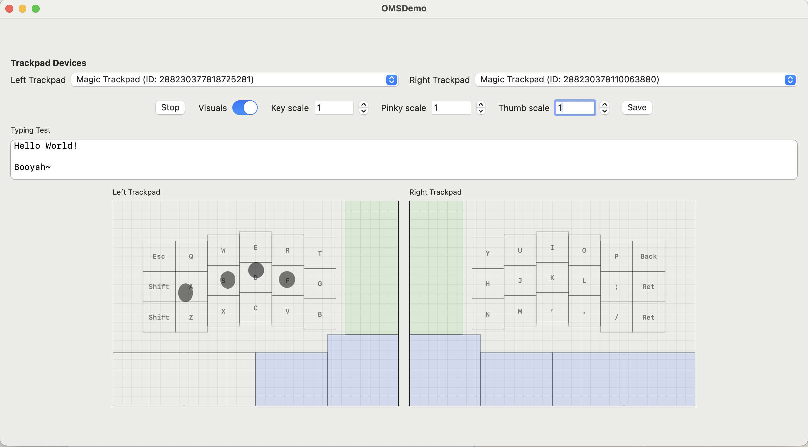

# GlassToKey

## Intention
An attempt to use the Apple Magic Trackpad as a keyboard (and mouse!) like the TouchStream LP~ 
Since it is built on the same technology, I thought it would be fun to try and create an open source version!

It's just Codex and I vibe coding~ you can submit an issue but this is really just a repo for me, you might have to fork and extend!

## Demo

**Latest demo updates:** per-key scaling controls (key, pinky, thumb), device selectors, and a Save button that persists device IDs and layout/visual settings for quick reloads. Green zones toggle on/off typing mode~

## Usage

Build the demo and click Start to begin tracking fingers!  
You can stop the visualizer or minimize the window and it will still continue to work.

If you hold any key for longer than 200ms I have a whole hidden tap-hold layer.  
(Sorry it is not more user friendly at this point)

## TODO

This repo is not really in shape for users, but a developer could definitely get in and modify the keymap, etc. 

**I have a todo list in the AGENTS.md file if you want to check it out! Or load up codex and say, "read agents.md lets start on the todo" and start submitting PRs, lol!**

---

## References

**This is a fork of [Kyome22/OpenMultitouchSupport](https://github.com/Kyome22/OpenMultitouchSupport) with some added features.**

This library refers the following frameworks very much. Special Thanks!
- [Kyome22/OpenMultitouchSupport](https://github.com/Kyome22/OpenMultitouchSupport)
- [KrishKrosh/OpenMultitouchSupport](https://github.com/KrishKrosh/OpenMultitouchSupport)
- [mhuusko5/M5MultitouchSupport](https://github.com/mhuusko5/M5MultitouchSupport)
- [calftrail/Touch](https://github.com/calftrail/Touch/blob/master/TouchSynthesis/MultitouchSupport.h)

## Requirements

- Development with Xcode 16.0+
- swift-tools-version: 6.0
- Compatible with macOS 13.0+
