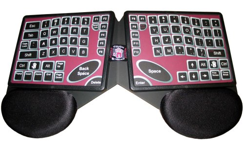

# GlassToKey

## NOT ABANDONED, JUST MOVED:
- https://github.com/disarmyouwitha/AppleMagicTouchstreamLP

Consolidating both OSX and WIN repositories under a cooler name!

.......
......
.....
....
...
.......
......
.....
....
...
......
.....
....
...
..
.

## Intention
An attempt to use the Apple Magic Trackpad as a keyboard (and mouse!) like the TouchStream LP~
Since it is built on the same technology, I thought it would be fun to try and create an open source version!

It's just Codex and I vibe coding~ You can submit an issue but this is really just a repo for me, you might have to fork and extend!
